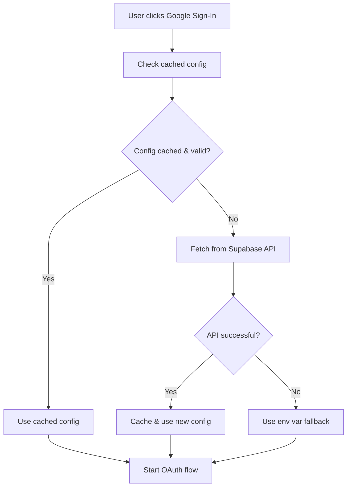

# 🚀 Dynamic Google OAuth Configuration

Your app now uses **dynamic Google OAuth configuration** fetched from Supabase Edge functions! This makes your app fully transferable without code changes.

## 🎯 Benefits

✅ **No hardcoded credentials** in your app code
✅ **Easy app transfer** - just update Supabase secrets
✅ **Environment-specific configs** (dev/staging/prod)
✅ **RevenueCat integration** - all keys in one place
✅ **Automatic fallbacks** - uses env vars if API fails
✅ **Cached configuration** - fast performance

## 🔧 Setup Instructions

### 1. 📱 Supabase Edge Function (Already Done!)

Your edge function now serves Google OAuth configuration:
- **Function**: `/supabase/functions/api-keys/index.ts`
- **New fields**: `GOOGLE_OAUTH_CLIENT_ID`, `GOOGLE_OAUTH_REDIRECT_URI`

### 2. 🔐 Add Secrets to Supabase

Go to **Supabase Dashboard** → **Settings** → **Edge Functions** → **Environment Variables**

Add these secrets:

```bash
# Google OAuth Configuration
GOOGLE_OAUTH_CLIENT_ID=272010092004-la0167jf3d6o7f7g6hc50961ll7m7ujr.apps.googleusercontent.com
GOOGLE_OAUTH_REDIRECT_URI=vetpaw://auth/callback

# RevenueCat (already have these)
REVENUECAT_GOOGLE_API_KEY=goog_dgbtTIHVqfMOYcyTuDiaaZBreVi
REVENUECAT_APPLE_API_KEY=appl_your_ios_key_here
```

### 3. 🚀 Deploy Edge Function

```bash
# Navigate to your project
cd project

# Deploy the updated API keys function
npx supabase functions deploy api-keys
```

### 4. ✅ Test Configuration

Your app will now:
1. **Fetch Google OAuth config** from Supabase on first sign-in
2. **Cache config for 10 minutes** for performance
3. **Fallback to env vars** if API is unavailable
4. **Log configuration status** for debugging

## 📱 How It Works

### Dynamic Configuration Flow



### Code Structure

```typescript
// Dynamic Google Auth Service
const config = await apiKeysService.getGoogleOAuthConfig();

// Returns:
{
  clientId: "272010092004-...",
  redirectUri: "vetpaw://auth/callback"
}
```

## 🔄 App Transfer Process

### For New Environment:

1. **Clone your Supabase project** or create new one
2. **Update environment variables** in new project:
   ```bash
   GOOGLE_OAUTH_CLIENT_ID=your-new-client-id
   GOOGLE_OAUTH_REDIRECT_URI=yournewapp://auth/callback
   ```
3. **Deploy edge function**:
   ```bash
   npx supabase functions deploy api-keys
   ```
4. **Update app's `.env`** with new Supabase URL:
   ```bash
   EXPO_PUBLIC_SUPABASE_URL=https://your-new-project.supabase.co
   EXPO_PUBLIC_SUPABASE_ANON_KEY=your-new-anon-key
   ```
5. **Build and deploy** - no code changes needed! 🎉

### For Different Environments:

**Development**:
```bash
GOOGLE_OAUTH_CLIENT_ID=dev-client-id
GOOGLE_OAUTH_REDIRECT_URI=vetpaw-dev://auth/callback
```

**Staging**:
```bash
GOOGLE_OAUTH_CLIENT_ID=staging-client-id
GOOGLE_OAUTH_REDIRECT_URI=vetpaw-staging://auth/callback
```

**Production**:
```bash
GOOGLE_OAUTH_CLIENT_ID=prod-client-id
GOOGLE_OAUTH_REDIRECT_URI=vetpaw://auth/callback
```

## 🛠️ Management & Debugging

### Check Configuration Status

```typescript
// Get all service configuration status
const status = await apiKeysService.getConfigurationStatus();
console.log('Google OAuth configured:', status.google_oauth);

// Get specific Google OAuth config
const config = await dynamicGoogleAuth.getConfigurationInfo();
console.log('Current config:', config);
```

### Force Refresh Configuration

```typescript
// Refresh configuration from server
await dynamicGoogleAuth.refreshConfiguration();
```

### Debug Information

The app logs detailed configuration info:
```
🔄 Fetching Google OAuth config from Supabase...
✅ Google OAuth config loaded: { clientId: 'SET', redirectUri: 'vetpaw://auth/callback' }
📋 Using Google OAuth config: { clientId: '272010092004...', redirectUri: 'vetpaw://auth/callback' }
```

## 🔒 Security Features

✅ **Authentication required** - only authenticated users can fetch keys
✅ **Cached responses** - reduces API calls
✅ **Fallback protection** - app works even if API fails
✅ **No sensitive data in logs** - only shows if keys are SET
✅ **Environment isolation** - different configs per environment

## 📋 Migration Checklist

- [ ] Add `GOOGLE_OAUTH_CLIENT_ID` to Supabase secrets
- [ ] Add `GOOGLE_OAUTH_REDIRECT_URI` to Supabase secrets  
- [ ] Deploy updated edge function
- [ ] Test Google sign-in flow
- [ ] Verify configuration caching
- [ ] Test with network disconnected (should use fallback)
- [ ] Remove hardcoded Google Client ID from code (optional)

## 🚨 Troubleshooting

### "Google OAuth Client ID not configured properly"
- Check Supabase secrets are set correctly
- Verify edge function is deployed
- Check user is authenticated when fetching

### "Failed to fetch Google OAuth config"
- App will automatically use environment variable fallback
- Check network connectivity
- Verify Supabase edge function is accessible

### Configuration not updating
- Force refresh: `await dynamicGoogleAuth.refreshConfiguration()`
- Cache duration is 10 minutes
- Clear app data to reset cache

Your app is now **fully dynamic and transferable**! 🚀